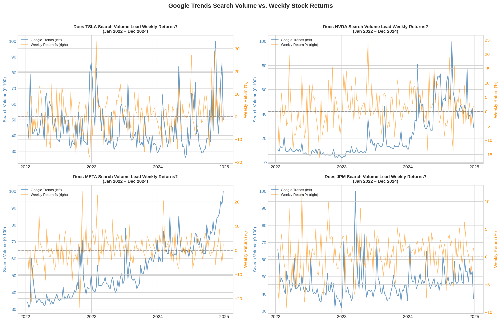
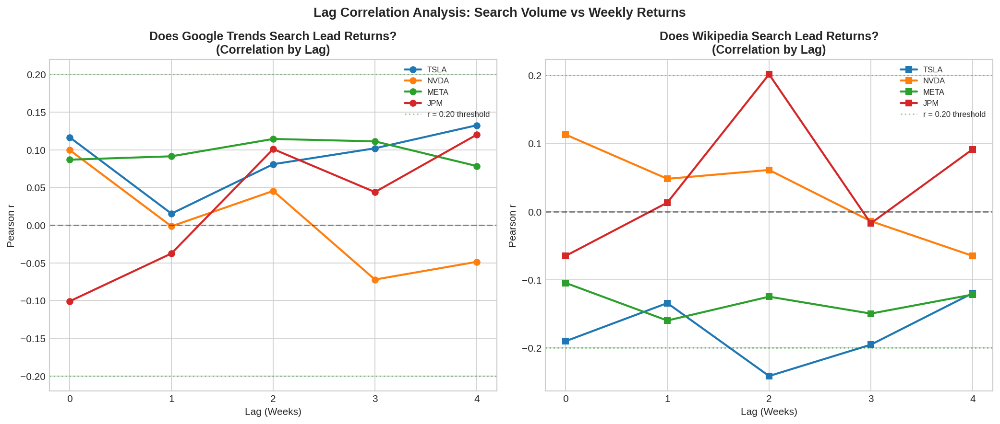

# Eight Tests, Eight No-Gos: Screening Online Attention as a Stock Signal

**Recommendation: Do not proceed with a trading signal.** The analysis found no strong evidence that Google Trends or Wikipedia page views showed a lead relationship with weekly returns for any of the four stocks. This held across both datasets using the specified lag, suggesting that neither source provides a reliable signal.

***Stack: Python · pandas · scipy · Plotly · Streamlit***

**Live Interactive Dashboard:** 
[**search-trends-vs-stock-returns.streamlit.app**](https://search-trends-vs-stock-returns.streamlit.app/)

*Stock Selector | Data Filter | Live Correlation Recompute*

The screening logic runs live. Narrows the date range and every correlation recomputes on the filtered window, with go/investigate/no-go recommendations updating per stock and per proxy.

-------

## Research Question

An investment advisory firm is considering building a tool around online attention data. Before committing budget they want to know if **is there a signal here worth chasing?**

## Conclusion

Eight tests, four stocks (TSLA, NVDA, META, JPM) × two independent attention sources, tested over three years of weekly data (Jan 2022 to Dec 2024).

**All eight came back no-go.**

| Stock | Google Trends (lag 1) | Wiki (lag 1) |
|--------|----------------------|-------------------|
| TSLA | +0.0153 | −0.1343 |
| NVDA | −0.0015 | +0.0480 |
| META | +0.0913 | −0.1599 |
| JPM | −0.0375 | +0.0131 |

The largest observed relationship explained approximately 2.6% of weekly return variation, while the smallest explained approximately 0.0002%.

*If search activity led prices, search spikes should come before return spikes. They do not.*

**Recommendation:** do not invest in developing an attention based signal for these stocks. The results provide no evidence that such a signal would be reliable.

 

-------

## Pre-Registered Analysis Criteria

Before any data was pulled, a business action bar was fixed:

| Tier | Threshold | Meaning |
|------|-----------|---------|
| **no-go** | r < 0.20 | Explains under 4% of movement, which is not worth pursuing. |
| **investigate** | 0.20 ≤ r < 0.40 | Worth a closer look. |
| **go** | r ≥ 0.40 | Strong enough to build on. |

**A one week lag (last week's attention tested against this week's return) was locked as the primary test before any results were seen.**

This matters because checking every possible lag and keeping the best result introduces data dredging. If enough lags are tested, some correlations will appear stronger purely by chance. Pre-selecting lag 1 avoids this problem and keeps the analysis focused on the original research question. Of the 40 correlations tested, only two exceeded 0.20, and both occurred at unregistered lags with opposite signs. This is exactly the type of pattern expected from random variation alone (40 × 0.05 = 2), supporting fixing the lag before testing.

These thresholds are a *business* action bar, not a statistical convention. They answer the practical question of how strong must a correlation be before a firm should spend money on it?

*All five lags remain below the 0.20 threshold, including the pre-registered lag 1.*

 

## Assessing Whether the Sample Size Was Sufficient

The standard objection to any null result falls in the lack of findings due to insufficient sample size. The numbers prove otherwise.

- At n = 154 lag-1 pairs, the smallest correlation reaching statistical significance is **r ≈ 0.158** while the pre-registered threshold is **r = 0.20**.

***Note: The 155-week dataset loses one more row to the one-week shift*** 

**Any correlation strong enough to act on would have been detected.** The null reflects an absent signal, not an insufficient sample.

## Two Sources with The Same Answer

Two attention proxies were used to measure different behaviours:

- **Google Trends** is an active search intent, ex. someone typed the ticker.
- **Wikipedia page views** showcases passive consumption, ex. someone reading about the company.

Both measures fall within the no-go band for all four stocks. Using two independent attention proxies improves robustness, as a null result from a single source could be driven by that specific source's characteristics rather than the underlying relationship.

: Daily closing price, auto-adjusted for splits and dividends
2. Google Trends (pytrends): Individuals actively searching. A 0-100 weekly relative interest index.
3. Wikipedia Page Views (Wiki REST API): Individual's passive attention.

Note: Two attention sources are used deliberately to gain a more complete and credible result than a single source provides.

**Alignment**

All sources were placed on one weekly Friday-anchored calendar (Friday close for prices, summed weekly totals for Wiki views, Sunday-anchored Trends values resampled to Friday) and combined with an inner join. The join kept 156 weeks (0.6% of observations lost). Converting prices to weekly returns drops the first week, as it has no prior week to compare against, making the final dataset 155 weeks.

**Returns (Not Prices)**

Stock prices were converted into weekly percentage returns before calculating correlations. Using raw prices can be misleading because most stocks trend upward over time, which can make unrelated stocks appear correlated. Converting prices into returns removes this trend and focuses on how stocks move from week to week.

## Statistics

Pearson’s r is used as the main correlation measure, with Spearman’s r included as a robustness check. A difference of more than 0.10 between the two measures is treated as a potential concern. R² is reported to help interpret the strength of relationships. P-values are not the main focus because, with eight tests, some statistically significant results could occur by chance. Decisions are therefore based primarily on the size and consistency of the effects.

-------
## Charts

| # | Title                     | Type                 | Notes                                     |
|---|---------------------------|----------------------|-------------------------------------------|
| 1 | Time Series (All Stocks)  | Dual-axis line chart | Search volume Vs. Weekly Return per stock.|
| 2 | Lag Correlation Chart     | Line chart           | Correlations by lag (0–4). Lag 1 was the pre-specified test; the remaining lags are shown only for exploratory purposes.|
| 3 | Proxy Comparison Chart    | Bar chart            |  Both sources at lag 0. The null holds across two independent measures as all eight bars sit inside the ±0.20 band.       

-------
## Outputs

Pre-run outputs are in /outputs so you can review result without running the notebook:
 
| File                    | Contents                                               |
|-------------------------|--------------------------------------------------------|
| data_aligned.csv        | 155 week aligned dataset (Jan 2022–Dec 2024) per stock, weekly return, Google Trends volume, Wikipedia views, and lagged attention columns.               |
| findings.csv            | 8 rows (4 stocks × 2 proxies) pre-registered lag-1 correlation, lags, and the go/investigate/no-go recommendation per test.                              |

-------

## How to Run
**Notebook**

The raw pulls are committed to /data. Section 2 (live API collection) documents how the data was gathered but it should be skipped as data is canonical. Section 3 is the starting point as it reads the committed CSVs. Google Trends returns a normalized index that varies between calls so re-pulling will not reproduce these exact numbers.

**Dashboard**

Runs locally with no live API calls (it reads the pre-exported CSVs):
- pip install -r requirements.txt
- streamlit run dashboard.py

Place data_aligned.csv and findings.csv in the same folder as dashboard.py. The dashboard recomputes correlations based on the selected date range, so narrowing the range may change the displayed values.

-------

## Limitations

- Weekly Granularity: A daily analysis might reveal a faster structure that a weekly view averages away. 
- One Three Year Window: A different time period could have behaved differently.
- No Macro Controls: Overall market moves, sector rotation, and volatility regime are not controlled for.
- Lag 2: Since lag 2 was not pre-specified, these results would need holdout confirmation and are not used in recommendations.
- Public Data Priced In: Any genuine signal in freely available attention data is plausibly reflected in the price already, a reason to expect a null. 
-------

## Disclaimer 
*This project is for educational and portfolio purposes only. The business context is illustrative and should not be interpreted as investment advice.* 
