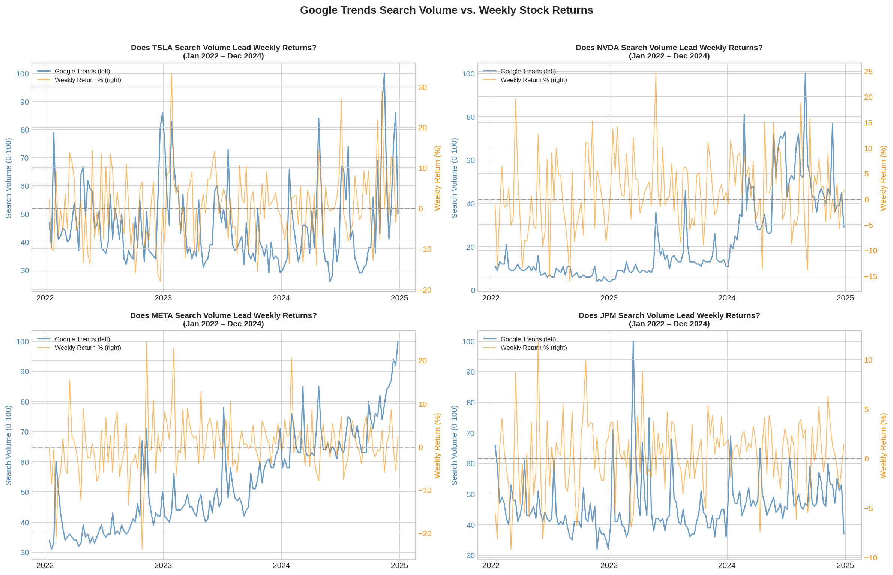
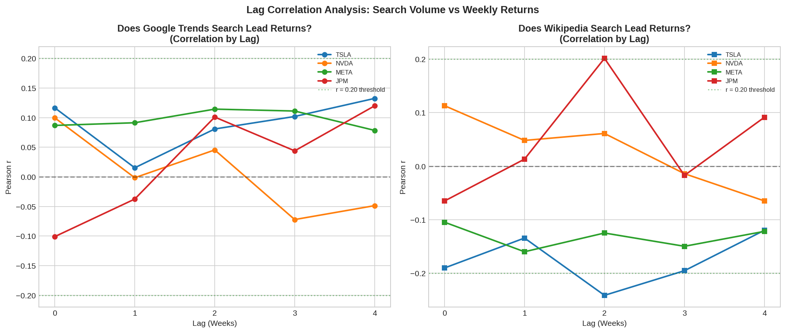

# Eight Tests, Eight No-Gos: Screening Online Attention as a Stock Signal

**Recommendation: Don't build a signal on this.** Across four stocks and two data sources, tested at the one-week delay and locked in before any results were seen, neither Google Trends nor Wikipedia views showed a meaningful link to next week's return.

***Stack: Python · pandas · scipy · Plotly · Streamlit***

**Live Interactive Dashboard:** 
[**search-trends-vs-stock-returns.streamlit.app**](https://attention-vs-stock-returns.streamlit.app/)

*Stock Selector | Data Filter | Live Correlation Recompute*

Narrow the date range to update the lag-correlation chart live so you can check whether the pattern holds on a shorter window.

-------

## Research Question

An investment advisory firm is considering building a tool around online attention data. Before committing budget they want to know if **is there a signal here worth chasing?**

## Conclusion

Eight tests, four stocks (TSLA, NVDA, META, JPM) × two independent attention sources, tested over three years of weekly data (Jan 2022 to Dec 2024).

**All eight came back no-go.**

| Stock | Google Trends (lag 1) | Wiki (lag 1) |
|--------|----------------------|-------------------|
| TSLA | +0.0153 | −0.1343 |
| NVDA | −0.0015 | +0.0480 |
| META | +0.0913 | −0.1599 |
| JPM | −0.0375 | +0.0131 |

The largest observed relationship explained approximately 2.6% of weekly return variation, while the smallest explained approximately 0.0002%.

*If search activity led prices, search spikes should come before return spikes. They do not.*

 

-------

## Pre-Registered Analysis Criteria

Before any data was pulled, a business action bar was fixed:

| Tier | Threshold | Meaning |
|------|-----------|---------|
| **no-go** | r < 0.20 | Explains under 4% of movement, which is not worth pursuing. |
| **investigate** | 0.20 ≤ r < 0.40 | Worth a closer look. |
| **go** | r ≥ 0.40 | Strong enough to build on. |

**A one week lag (last week's attention tested against this week's return) was locked as the primary test before any results were seen.**

This matters because checking every possible lag and keeping the best result introduces data dredging.  eWith enough delayed tested some will look stronger purely by chance. Commiting to one week in advance avoids that trap and keepa the test honest. 

Of the 40 correlations tested only two exceeded 0.20 (TSLA -0.2413 and JPM +0.2013), both on Wikipedia, both lag 2 and neither pre-registered. This is roughly the type of pattern expected by chance alone (40 × 0.05 = 2), supporting fixing the lag before testing.

These thresholds are a *business* action bar, not a statistical convention. They answer the practical question of how strong must a correlation be before a firm should spend money on it?

*Most of the five lags remain below the 0.20 threshold, including the pre-registered lag 1.*

 

## Assessing Whether the Sample Size Was Sufficient

The standard objection to a null result is that the sample was too small to detect anything. The numbers prove otherwise.

- With 154 weekly comparisons, the smallest relationship that could still show up as statistically real is **r ≈ 0.158**.

***Note: The 155-week dataset loses one more row to the one-week shift*** 

**Any correlation strong enough to act on would have been detected.** The null reflects an absent signal, not an insufficient sample.

## Two Sources with The Same Answer

Two attention proxies were used to measure different behaviours:

- **Google Trends** is an active search intent, ex. someone typed the ticker.
- **Wikipedia page views** shows passive consumption, ex. someone reading about the company.

Both measures fall within the no-go band for all four stocks. Using two independent attention proxies improves robustness, as a null result from a single source could be driven by that specific source's characteristics rather than the underlying relationship.

*At lag 0, all eight bars fall within the ±0.20 range; neither proxy exceeds the threshold.*

-------

## Stock Specific Notes

**TSLA:** Common Elon Musk news spikes tend to produce same week co-movement rather than a one week lead.

**NVDA:** Search volume and returns have been driven in part by the AI narrative, in cases this is a shared external driver producing same week co-movements rather than a lead.

**JPM:** The weak result is expected from an institutionally traded company. Chosen as a deliberate contrast. 

**META:** No single external noise source similar to the other stocks, so adding a note would be unwarranted.

-------

## Methodology
**Three Independent Data Sources**
1. Yahoo Finance (yfinance): Daily closing price, auto-adjusted for splits and dividends
2. Google Trends (pytrends): Individuals actively searching. A 0-100 weekly relative interest index.
3. Wikipedia Page Views (Wiki REST API): Daily article views, a passive attention measure.

Note: Two attention sources are used deliberately to gain a more complete and credible result than a single source provides.

**Alignment: Getting Three Calendars to Agree**

All three sources were aligned to a single Friday-anchored weekly calendar, with checks confirming that no weeks were silently lost or duplicated.

*The Problem:* The three sources use different calendars. Stock prices only exist on trading days, Wikipedia reports daily counts, and Google Trends reports Sunday to Saturday weeks.

*The fix:* Everything was put onto the same Friday anchored weekly calendar. Friday’s closing price represents the trading week, Wikipedia’s daily counts were summed, and Google Trends’ Sunday-start weeks were shifted onto the Friday calendar.

*The Result:* All three sources initially lined up across 157 weeks. One trailing partial week was then removed because it only contained two trading days and four Wikipedia days. Then 155 remained once the first week was used to calculate the first return. In total, 0.6% of the data was excluded.

*Extra Checks:* Ticker searches were also compared with full company name searches. TSLA and JPM produced materially different signals (r = 0.731 and 0.652), supporting the use of tickers as a more investor specific measure.

Wikipedia series were screened for unusually large spikes (days above ten times the median). NVDA had four such spikes, on the 22–23 of Feb, 6 of June, and 19 of June 2024. These coincided with an earnings report and the June 2024 ten for one stock split. They were kept rather than treated as noise.

**Returns (Not Prices)**

Stock prices were converted into weekly percentage returns before calculating correlations. Using raw prices can be misleading because most stocks trend upward over time, which can make unrelated stocks appear correlated. Converting prices into returns removes this trend and focuses on how stocks move from week to week.

## Statistics

Pearson’s r is the main correlation measure, with Spearman’s r as a robustness check. A difference of more than 0.10 between the two measures is treated as a potential concern. R² is reported to help interpret the strength of relationships. P-values are not the main focus because, with eight tests, some statistically significant results could occur by chance. Decisions are therefore based primarily on the size and consistency of the effects.

-------
## Charts

| # | Title                     | Type                 | Notes                                     |
|---|---------------------------|----------------------|-------------------------------------------|
| 1 | Time Series (All Stocks)  | Dual-axis line chart | Search volume Vs. Weekly Return per stock.|
| 2 | Lag Correlation Chart     | Line chart           | Correlations by lag (0–4). Lag 1 was the pre-specified test; the remaining lags are shown only for exploratory purposes.|
| 3 | Proxy Comparison Chart    | Bar chart            |  Both sources at lag 0. The null holds across two independent measures as all eight bars sit inside the ±0.20 band.       

-------
## Outputs

Pre-run outputs are in /outputs so you can review result without running the notebook:
 
| File                    | Contents                                               |
|-------------------------|--------------------------------------------------------|
| data_aligned.csv        | 155 week aligned dataset (Jan 2022–Dec 2024) per stock, weekly return, Google Trends volume, Wikipedia views, and lagged attention columns.               |
| findings.csv            | 8 rows (4 stocks × 2 proxies) pre-registered lag-1 correlation, lags, and the go/investigate/no-go recommendation per test.                              |

-------

## How to Run
**Notebook**

The raw pulls are committed to /Data. Section 2 (live API collection) documents how the data was gathered but it should be skipped as data is canonical. Section 3 is the starting point as it reads the committed CSVs. Google Trends returns a normalized index that varies between calls so re-pulling will not reproduce these exact numbers.

**Dashboard**

Runs locally with no live API calls (it reads the pre-exported CSVs):
- pip install -r requirements.txt
- streamlit run dashboard.py

Place data_aligned.csv and findings.csv in the same folder as dashboard.py. Narrowing the date range in the sidebar updates the lag-correlation chart live. The metric cards, summary table and recommendation text reflect the full three-year study and do not change with the date filter.

-------

## Whats Next?

- *Attention changes not attention levels:* Re-running tests on week over week attention changes against a trailing mean to test whether sudden chnages in attention, rather than attention levels, predicts returns. 
- *Holdout test of lag 2:* Pre-register lag 2 on a fresh 2025 and onward window and test whether the TSLA and JPM Wikipedia results that passed the threshold survive out of sample.
- *Finer granularity:* Testing daily or intraday data to see whether a signal exists but is simply too short lived for a weekly analysis to capture. 

-------

## Limitations

- One Three Year Window: A different time period could have behaved differently.
- No Macro Controls: Overall market moves, sector rotation, and volatility regime are not controlled for.
- Public Data Priced In: Any genuine signal in freely available attention data is plausibly reflected in the price already, a reason to expect a null. 
- Weekly Granularity: A daily analysis might reveal a faster structure that a weekly view averages away. 
- Lag 2: Since lag 2 was not pre-specified, these results would need holdout confirmation and are not used in recommendations.

-------

## Disclaimer 
*This project is for educational and portfolio purposes only. The business context is illustrative and should not be interpreted as investment advice.* 